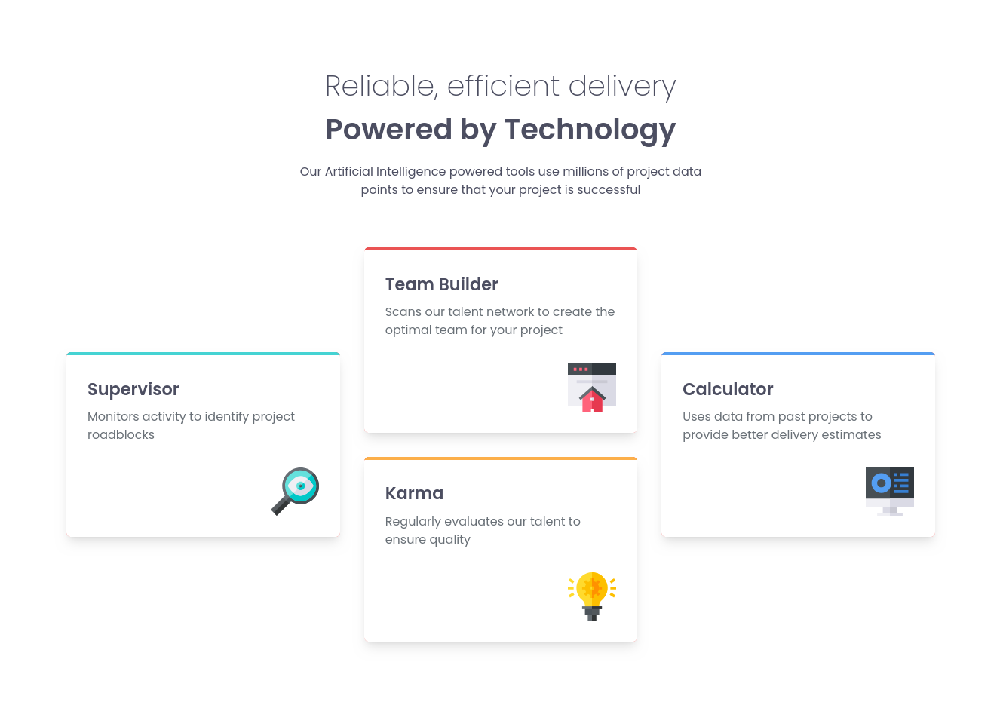

# Frontend Mentor - Four card feature section solution

This is a solution to the [Four card feature section challenge on Frontend Mentor](https://www.frontendmentor.io/challenges/four-card-feature-section-weK1eFYK). Frontend Mentor challenges help you improve your coding skills by building realistic projects.

## Table of contents

- [Overview](#overview)
  - [The challenge](#the-challenge)
  - [Screenshot](#screenshot)
  - [Links](#links)
- [My process](#my-process)
  - [Built with](#built-with)
  - [What I learned](#what-i-learned)
  - [Continued development](#continued-development)
  - [Useful resources](#useful-resources)
- [Author](#author)
- [Acknowledgments](#acknowledgments)

## Overview

### The challenge

Users should be able to:

- View the optimal layout for the site depending on their device's screen size

### Screenshot

### Links

- Solution URL: [https://www.frontendmentor.io/solutions/responsive-features-section-with-flexbox-grid-react-and-tailwind-css-BV1XKRx51K](https://www.frontendmentor.io/solutions/responsive-features-section-with-flexbox-grid-react-and-tailwind-css-BV1XKRx51K)
- Live Site URL: [https://features-section-gray.vercel.app/](https://features-section-gray.vercel.app/)

## My process

### Built with

- Semantic HTML5 markup
- Flexbox
- CSS Grid
- Mobile-first workflow
- [React](https://reactjs.org/) - JS library
- [Tailwind CSS](https://tailwindcss.com/) - For styles

### What I learned

With this challenge I used Tailwind for the first time myself, I build this just following the docs so I learned a lot of stuff.

### Continued development

From now on, I'll try to use Taiölwind CSS as my default way of styling my web projects. I'll dive deeper into it and it's best practices.

### Useful resources

- [Fluid Typography Calculator](https://royalfig.github.io/fluid-typography-calculator/) - Useful resource that helped me implement a correct fluid typography with the `clamp()` function
- [Tailwind CSS Docs](https://tailwindcss.com/docs) - Tailwind CSS official documentation. The best resource to learn how to work with it.

## Author

- Frontend Mentor - [@yourusername](https://www.frontendmentor.io/profile/daxhoDev)
- Twitter - [@yourusername](https://www.twitter.com/daxhoDev)

## Acknowledgments

My friend Saúl ([@saulin18](https://github.com/)) helped me with some questions about tailwind. Thanks a lot bro!
